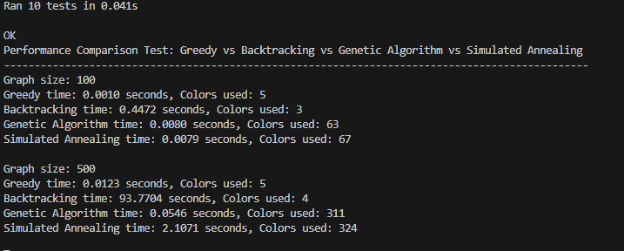

# **Advanced Graph Coloring with Constraints Project**
This project implements various graph coloring algorithms and provides a flexible framework for solving graph coloring problems.
## **How to Run**
1. Ensure you have Python 3.x installed. (I have worked on v3.12.4, but it shall work on every 3.x version)
1. Clone the repository or download all the Python files.
1. Run the main script:

Copy

python main.py

This will run the unit tests and perform a performance comparison of different coloring strategies.

## **Project Structure**
- main.py: Entry point of the application. Runs tests and performance comparisons.
- graph.py: Defines the Graph and Vertex classes.
- coloring\_strategies.py: Implements various coloring algorithms.
- coloring\_solver.py: Defines the ColoringSolver class.
- constraint\_manager.py: Manages constraints for the graph coloring problem.
- exceptions.py: Custom exception classes.
- tests.py: Unit tests for the project.
## **Key Components**
### **Graph (graph.py)**
- Graph: Represents the graph structure.
- Vertex: Represents a vertex in the graph.
### **Coloring Strategies (coloring\_strategies.py)**
1. GreedyColoringStrategy: A simple greedy algorithm. 
   - Time Complexity: O(V + E), where V is the number of vertices and E is the number of edges.
   - Space Complexity: O(V)
1. BacktrackingColoringStrategy: Uses backtracking with forward checking and MRV. 
   - Time Complexity: O(m^V) worst case, where m is the number of colors.
   - Space Complexity: O(V)
1. GeneticAlgorithm: Evolutionary approach to graph coloring. 
   - Time Complexity: O(G \* P \* V), where G is the number of generations, P is the population size, and V is the number of vertices.
   - Space Complexity: O(P \* V)
1. SimulatedAnnealing: Probabilistic technique for approximating the global optimum. 
   - Time Complexity: O(I \* V), where I is the number of iterations.
   - Space Complexity: O(V)
### **ColoringSolver (coloring\_solver.py)**
- ColoringSolver: Main class for solving graph coloring problems. 
  - solve(): Time and space complexity depends on the chosen strategy.
  - update\_coloring(): O(C + S), where C is the number of changes and S is the complexity of solve().
### **ConstraintManager (constraint\_manager.py)**
- Manages color constraints and pre-assignments.
- All operations have O(1) time complexity.
## **Performance Comparison**
The performance\_comparison\_test() function in main.py compares the performance of different coloring strategies on graphs of various sizes. Run the main script to see the results.
## **Extensibility**
To add a new coloring strategy:

1. Implement a new class in coloring\_strategies.py that inherits from ColoringStrategy.
1. Implement the color\_graph() method in your new class.
1. Use the new strategy with ColoringSolver in main.py.
## **Notes**
- The genetic algorithm and simulated annealing approaches may not always find the optimal solution but can perform well on large graphs.
- The backtracking strategy guarantees an optimal solution but may be slow for large graphs.
- The greedy strategy is fast but may use more colors than necessary.
- Since the backtracking approach takes a lot of time, a limit of 5 seconds has been set on execution time.
- For performance checking, it takes 100, 500 and 1000 vertices.
- The code can be further improved by adding stricter test case checking and edge case checking.
- Backtracking approach for bigger graphs if not ended early, might take several minutes to finish.
- Parallel computing can also be implemented for better performance.

